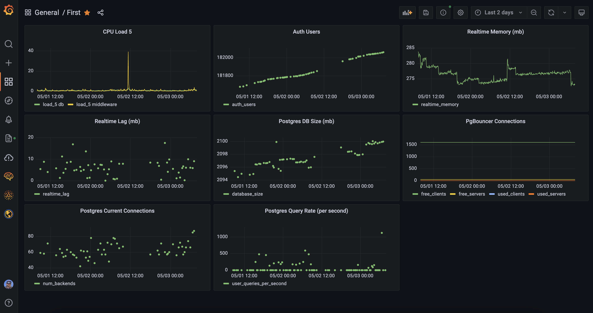

# Supabase Prometheus Metrics & Grafana

## Grafana Cloud API Keys

Sign up and get your API keys from Grafana Cloud.

Go to grafana.com > in the nav click my account > and then click `API Keys`

## Grafana Cloud Prometheus Remote Write Endpoint

Go to grafana.com > in the nav click my account > and then click `details` for Prometheus in your "Grafana Cloud Stack"

## Setup Config

 * Change the `app` name in the `fly.toml`
 * Make sure your `static_configs` `targets` is your Supbase project hostname
 * Make sure your `metrics_path` is correct in `agent.yaml`
 * Make sure your `remote_write` `url` is correct in `agent.yaml`

## Deploy on Fly

 * Sign up for Fly and run `fly deploy --config fly.toml`

## Default Grafana Dashboard

See [panels.json](panels.json) for a quick Grafana layout. 

Create a new dashboard and replace the `panels` value with this in the Grafana JSON Model.

## Useful Links
https://grafana.com/docs/agent/latest/getting-started/create-config-file/

## Exported metrics:
A list of exported metrics can be found [here](./metrics.md)

